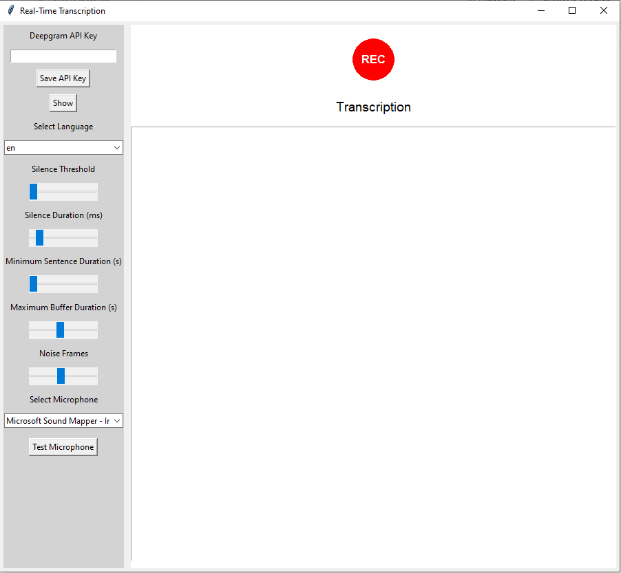

# Real-Time Transcription App

This repository contains a real-time transcription application that records audio from a microphone, transcribes the speech using the Deepgram API, and displays the results in a GUI built with Tkinter. The app uses multiple files for different functionalities, such as microphone handling, transcription processing, and secure storage of API keys.

## Features

- **Real-Time Transcription**: Speech-to-text transcription using the Deepgram API.
- **Customizable Parameters**: Adjust silence threshold, silence duration, and other transcription settings.
- **Microphone Testing**: Test and select the active microphone device.
- **API Key Management**: Secure handling of Deepgram API keys using hashing and file storage.
- **Hotkey Support**: Use `Ctrl + Shift + R` to toggle recording on/off.
- **Language Support**: Select the language for transcription from a dropdown menu.
- **Clipboard Integration**: Transcribed text can be automatically typed out using `pyautogui`.

## Files

1. **`app.py`**:
   - The main application that builds the GUI and handles real-time transcription.
   - Includes functionality to start/stop recording, select microphone, and adjust transcription settings.

2. **`Transcription.py`**:
   - Contains the logic for capturing microphone input, detecting silence, and sending audio data to Deepgram for transcription.
   - Handles the real-time transcription process via a WebSocket connection to the Deepgram API.

3. **`utilities.py`**:
   - Manages the secure handling of the Deepgram API key.
   - Provides functions for hashing, saving, and loading the API key.

## Prerequisites

Before running the application, make sure you have the following installed:

- **Python 3.7+**
- **Required Python Packages**:
  - `tkinter` (for the GUI)
  - `sounddevice` (for accessing the microphone)
  - `numpy` (for processing audio data)
  - `websockets` (for interacting with Deepgram API)
  - `pyautogui` (for typing transcriptions automatically)
  - `keyboard` (for hotkey functionality)
  - `asyncio` (for handling asynchronous tasks)

You can install the required packages with the following:

```bash
pip install sounddevice numpy websockets pyautogui keyboard asyncio 
```


## Setup

### Deepgram API Key:

- You need a Deepgram API key to use the transcription service.
- You can obtain an API key by signing up on [Deepgram's website](https://www.deepgram.com/).
- Once you have your API key, you can either input it directly through the app or save it in the app's settings.

### Save API Key:

- The app uses a secure method for storing the API key by hashing it before saving. The API key is stored in a hashed format to ensure security.
- On the left panel of the app, enter your API key and click **Save API Key**.

### Configure Microphone:

- Select the correct microphone from the dropdown list. The app will automatically detect all available microphones.
- Test the microphone using the "Test Microphone" button.

## Running the Application

To start the application, run the `app.py` script:

```bash
python app.py
```


## How It Works

### Microphone Input:
The application captures audio from the selected microphone in real-time. The microphone data is sent to the transcription service (Deepgram) via a WebSocket connection.

### Speech Detection:
The app processes the audio in small chunks and uses silence detection algorithms to identify the beginning and end of sentences. Silence detection is based on the RMS value of the audio data. If the audio is below a certain threshold for a defined duration, it is considered silent.

### Transcription:
The audio data is sent to Deepgram's API for transcription. The transcriptions are returned via WebSocket and displayed in real-time within the application. The transcribed text is also automatically typed out using `pyautogui`, making it easier to paste into any application.

### API Key Management:
The Deepgram API key is securely saved by hashing it before storage. The key is used for authentication when sending audio to the Deepgram API.

## Screenshots

Here are some screenshots of the application in action:

1. **Application Window**:  
   The main GUI window with the API key entry, microphone selection, and transcription output.  
   


## Troubleshooting

- **No Microphone Detected**: Make sure your microphone is connected and accessible. You can test it using the "Test Microphone" button.
- **API Key Issues**: If the API key is invalid or not working, ensure that it is entered correctly. You can verify the API key with Deepgram’s documentation.
- **WebSocket Connection Errors**: If the WebSocket connection closes unexpectedly, ensure your internet connection is stable and that the Deepgram API service is up and running.

## Future Enhancements

- **Language Support**: Expand to support more languages and models in Deepgram.
- **Performance Improvements**: Optimize the real-time transcription process for faster response times.
- **Additional Features**: Implement features like saving transcriptions to a file or directly integrating with other services (e.g., Slack, Google Docs).

